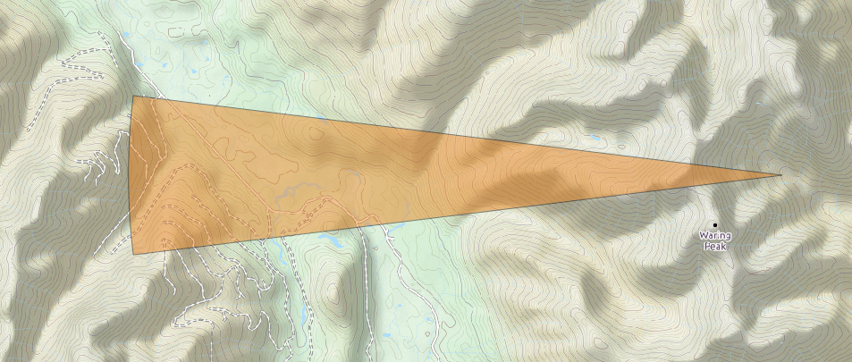

# azimuth-swath

Create these nifty little pie shaped polygons.

Designed to be used with [QGIS](http://www.qgis.org/en/site/), this plugin accepts a point location, distance and direction. The intended purpose is to map a surveyed transect. Taking into consideration a level of possible variance... Or error. Degrees variance can be adjusted along with the resolution of the outer fan.

Right now it only works with the New Zealand Mercator projection. Planning to revisit.
